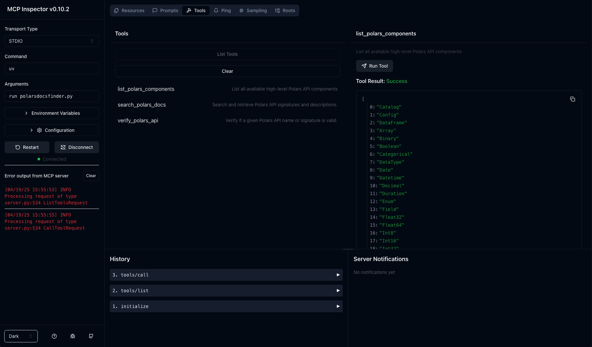
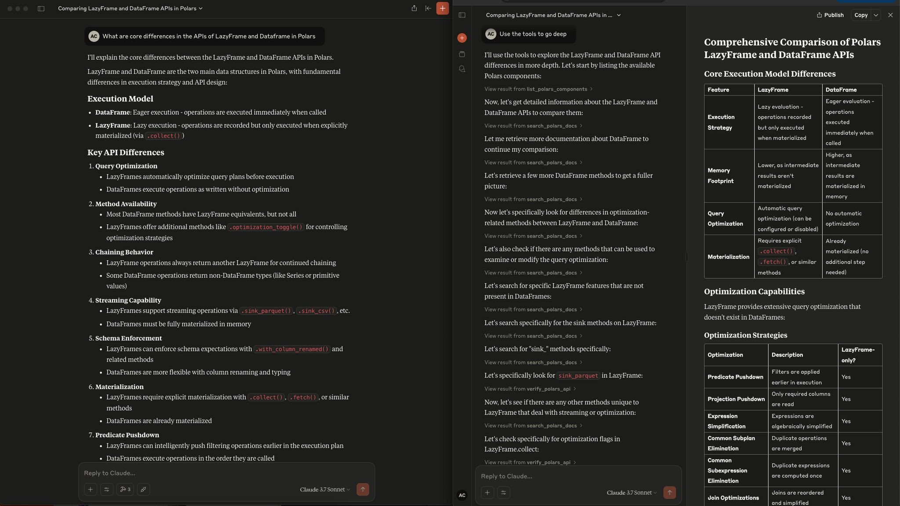
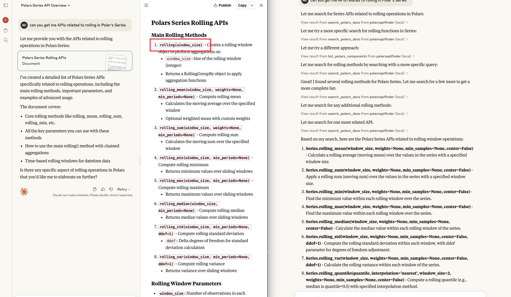

# Polars Docs MCP

A FastMCP tool to search and retrieve Polars API documentation.


## Features

- Automatically discover Polars public components (classes, functions, submodules).
- Search Polars API by component or query string.
- Returns structured JSON with API signatures and descriptions.
- Integrates with `mcp` for seamless LLM-powered workflows.

> By leveraging Python’s built‑in introspection to reflectively discover every public class, function, and submodule in Polars at runtime, I eliminate the cost, fragility, and maintenance burden of web‑scraping or managing an external documentation database. This approach guarantees 100% up‑to‑date accuracy with every library release, requires no complex text cleaning or embedding pipelines, and avoids the heavy infrastructure overhead of semantic search—making it both simpler and far more efficient for real‑time API lookup.


## Usage

1. Claude Desktop Config

```json
{
    "mcpServers": {
        "polarsapifinder": {
            "command": "uv",
            "args": [
                "--directory",
                "/PATH/TO/polars-docs-mcp",
                "run",
                "polarsdocsfinder.py"
            ]
        }
    }
}
```

2. Visual Testing of MCP Server

```bash
npx @modelcontextprotocol/inspector uv run polarsdocsfinder.py
```




Requires Python 3.11+.


### Tool Endpoints

- `list_polars_components()`: List all high-level Polars API components.
- `search_polars_docs(api_refs: list[str] | None, query: str | None, max_results: int = 1000)`: Search and retrieve API signatures.
- `verify_polars_api(api_ref: str)`: Verify if a Polars API reference is valid.


## Examples Snapshots





## License

This project is licensed under the MIT License. See the [LICENSE](LICENSE) file for details.

## Contact

Created by [ABC](mailto:abc@abhishekchoudhary.net). Report issues or request features at https://github.com/HotTechStack/polars-docs-mcp/issues.
